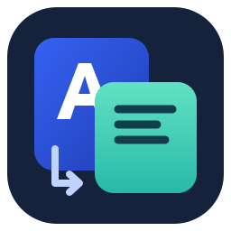
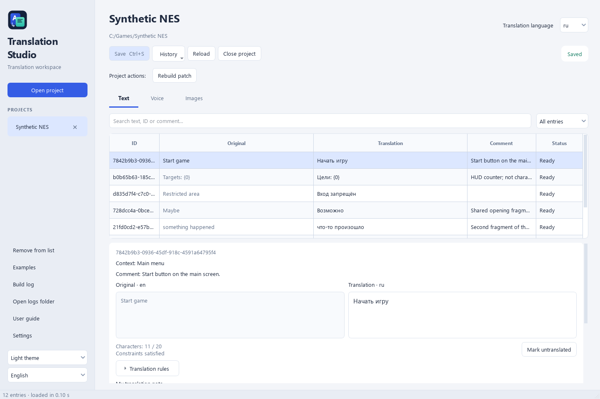
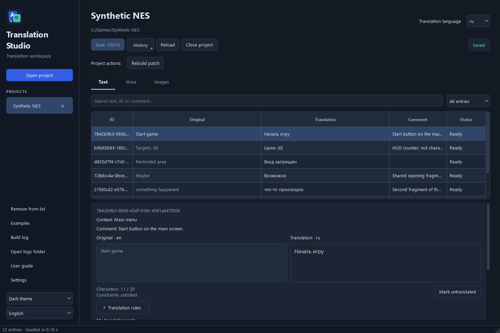

# Translation Studio

A Windows desktop workspace for comparing original game content with its translations. Edit text, inspect screenshots, compare images, audition audio, and run project-defined build commands.

Each game supplies `Translation/project.json`. The editor and the game's builder read the **same saved translation catalogs**. Adding a game requires no changes to the application.

[User guide](Docs/UserGuide.md) · [Русское руководство](Docs/UserGuide.ru.md) · [Русский обзор](README.ru.md) · [Documentation index](Docs/README.md)

## Run

**[Download for Windows — portable 1.0](https://github.com/M2us/translation-studio/releases/download/v1.0/Translation-Studio-Windows-Portable.zip)** · [All releases](https://github.com/M2us/translation-studio/releases) · [SHA-256 checksum](https://github.com/M2us/translation-studio/releases/download/v1.0/Portable-SHA256.txt)

Extract the complete `Translation-Studio-Windows-Portable.zip` and run **TranslationStudio.exe**. Keep the whole folder, including `_internal` and the CLI. No Python installation is needed. The folder must be writable for its local settings and logs.

Click **Open project** and select a game folder containing `Translation/project.json`. **Examples** opens two synthetic projects; copy an example to your own folder before experimenting. They contain no ROMs and are not translations of commercial games.

Source repository: [M2us/translation-studio](https://github.com/M2us/translation-studio). Local builds are generated under `Builds/Windows`; binary ZIPs are provided as release assets, not source control. GitHub's automatic **Source code** archives contain source files, not the portable app.

## Features

- Read-only originals, stable custom IDs, multiple target languages, search, filters and translator notes.
- A comparison table and detailed editor with character, byte, line and token rules, including allowed/forbidden character sets.
- Optional context screenshots and full sentences assembled from related fragments, including shared fragments.
- PNG comparison with zoom/pan and image alternatives; browsing and selecting the build resource are separate actions.
- WAV PCM comparison and sequential playback of related audio fragments.
- Project-defined build/validation buttons, cancellation of Windows process trees, bounded logs and configurable output decoding.
- Conflict detection, per-file atomic saves, one recovery draft and one previous saved state.
- Light/dark themes, English and Russian UI, saved preferences and local guides matching the UI language. English is the default.
- A headless CLI, JSON Schemas and a Python reader; game builders do not need Qt.

## Interface





## Develop

Use **Windows x64 and Python 3.12**. From this repository root:

```powershell
py -3.12 -m venv Work/venv
& ./Work/venv/Scripts/python.exe -m pip install -r Source/requirements-lock.txt
& ./Work/venv/Scripts/python.exe Scripts/render_guide.py
& ./Work/venv/Scripts/python.exe Source/app.py
```

[Contributing](CONTRIBUTING.md) covers change scope. [Architecture](Docs/Architecture.md) maps modules, [Testing](Docs/Testing.md) lists checks, and [Distribution](Docs/Distribution.md) describes packaging and source publication preparation.

## Integrate a game

Start with [IntegrationGuide](Docs/IntegrationGuide.md). Provide original/translated text under stable IDs, optional media/relations and a builder reading those catalogs. Game IDs, flags and offsets belong in `extensions`, preserved without interpretation.

See [ProjectFormat](Docs/ProjectFormat.md), [Relations](Docs/Relations.md), [BuildIntegration](Docs/BuildIntegration.md), [Schemas](Docs/Schemas/) and [API/CLI](Docs/API.md). AI agents start with [AGENTS.md](AGENTS.md) and [AgentGuide](Docs/AgentGuide.md); Claude Code also has [CLAUDE.md](CLAUDE.md).

## Layout

| Path | Purpose |
| --- | --- |
| `Source` | Desktop app, headless reader/CLI and dependencies |
| `Scripts` | Build, verification, example generation and documentation tools |
| `Tests` | Contract, saving, GUI, audio and process tests |
| `Assets` | Editable application icon and UI icons |
| `Examples` | Standalone synthetic projects and adapters |
| `Docs` | Public user/developer/agent docs and schemas |
| `Work`, `Builds`, `Data`, `Internal` | Ignored local work, outputs, preferences and private history |

## Status and limits

Translation Studio 1.0 is the first release of the app and portable Windows build. `schemaVersion: 1` identifies the data contract. Real-game compatibility, encodings, fonts, pointers and playable patches must be verified by each game's adapter.

Previews support PNG and integer PCM WAV. The app is unsigned and has no installer. Saving is atomic per file, not a transaction across catalogs. See [Testing](Docs/Testing.md) for verification scope and [StorageDiagnostics](Docs/StorageDiagnostics.md) for recovery/privacy.

Created by [M2us](https://github.com/M2us). Licensed under the [MIT License](LICENSE), copyright (c) 2026 M2us. Redistribution must retain the copyright and license notices. Third-party dependencies retain their own licenses; see [Distribution](Docs/Distribution.md).
